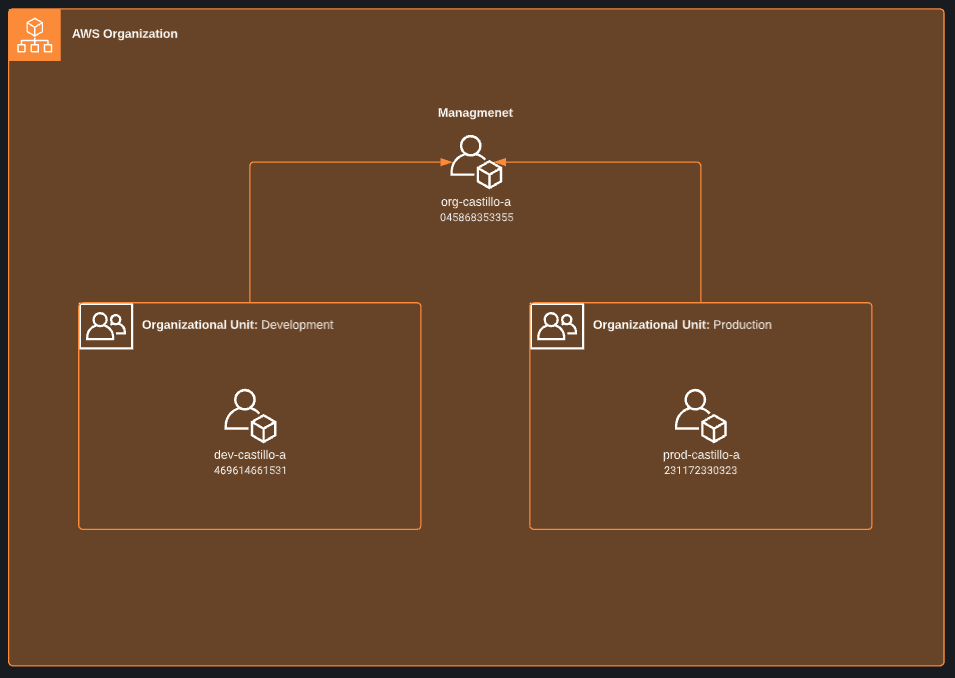
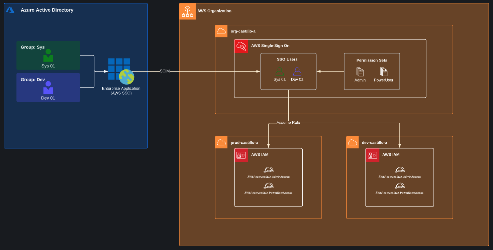
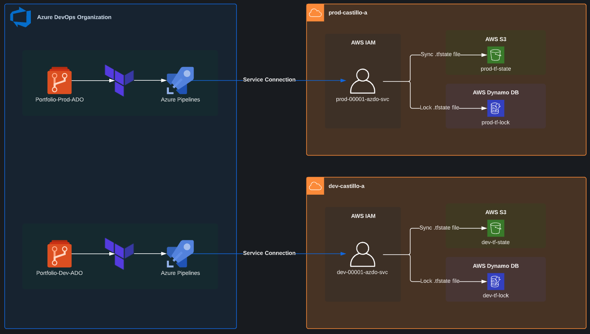

# AWS Organizations
To start off, my AWS environments are split between a management account, and two lower accounts (dev and prod). This is similar to many real organizations that follow best practice to split environments based on needs. For my purposes, I have simplified the number or environments compared to an enterprise company.

# Access Management
To secure my AWS environment, I have created my identites using Azure Active Directory. These identities each have access to AWS via an Enterprise Application configured to work with AWS SSO. Each user has been given specific permissions with Permission Set policies ensuring granular access.

This diagram is fairly basic and glosses over the way the permissions are distributed to child accounts and how the users are pushed from AAD to AWS. Regardless, it is a good representation of the architecture.

This setup ensures that root access will not be needed unless necessary and secures the access of AWS by using SAML based SSO. In many cloud based companies, user idenities are created in AD or AAD so this shows proper setup and management of access.

# Infrastructure as Code
To be a better DevOps Engineer, I will be making all deployments to my envronments using Azure DevOps pipelines and Terraform. This will allow for a seamless end-to-end process that will have automated approvals and deployments without having to ever manually deploy resources.

An important part of this is to automate the storage of the terraform.tfstate file. This file holds the current configuration of my environment and must be kept secure locked.

