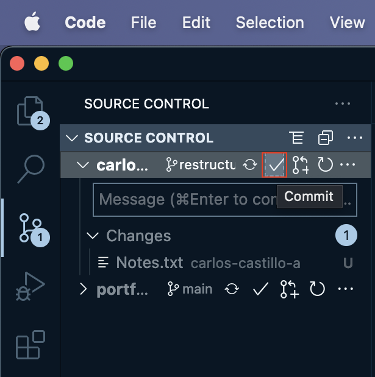
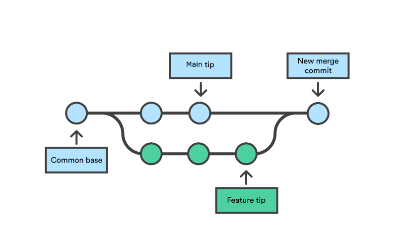

# Mar 27, 2022 8:37 PM CST
**---START---**
# VS Code and Github
In creating repositories and using VS Code to edit files/create git commands, I am learning a few helpful rules that I want to keep in mind.
I found a few extensions that have helped me keep track of my changes and understand what actions I am performing:
    - GitLens\
    - PasteImage\
    - Github Pull Requests & Issues\

# Commits
Staging in VS Code appears different than in command line; when a change is made, it is automatically noticed and tracked by the editor which you can review in the Source Control tab. 
The "messages" tab appears under any changes and I initially thought these messages were meant to be terminal commands which is why my early commits have command-like descriptions.
Making a commit in VS Code is actually a simple push of a button:

While this makes things easy, it is important to keep **commits** at a minimum, keeping the commits related to one another. This will make for much cleaner projects in the future.

### Commit Messages
The subject line should be a concise summary of what the change is. VS Code command palette doesn't have a way to add description lines so for long descriptions, they can be done in Terminal.
If there is an empty line after the subject, the body will be recorded.
The body should have a standard format for a more detail explanation:\
    - Difference: What is different now?\
    - Reason: What is the reason for the change\
    - Notes: Anything to watch out for?

# Branching
Branching strategy beigings with creating a good naming convention that each branch will have. Initially I was clueless on this step, but that was because I could not forsee my projects.
For my purposes, the branches I have are based on actions made by those branches. In this public repository, the long-running branches I will be using are:\
    -main\
        - restructure-master\
        - new_files-master\
        - remove_files-master\
It is just a beginning, things may change in the future but it will help keep track of what kind of changes are being committed. \
Commits should generally not be added directly to the *main* brach, that branch should only be updated through merges as in real scenarios.

# Pull Requets
Pull requests are generally meant for those working in teams to review changes before merging branches or commits. 
Since my projects will typically only involve myself, it is not very uselful in a practical sense, but I will make them nonetheless to get famialr with using them.
A pull request is performed when proposing changes/merges to a branch that can be reviewed by a teamate. This will allow a buffer zone to verify changes before they are in place.

# Merge & Rebase
When performing a merge, git will look at the differences in commits between branches and most commonly, a **Merge Commit** will occur.
A  **Merge Commit** is automatically created by Git, and connects two branches to a single point where both branches match.\ 
Rebase will make changes to branches in a more linear pattern. It will rewrite the order of commits to create a single branch from two with different types of commits.
Generally won't be used by me unless future conflicts occur. 

# Helpful git commands (Command line)
To keep my sanity, I will record some helpful git commands that I will keep using. These commands are good to remember if using terminal, but the same logic can apply using VS Code.
1. git clone <repository URL> -b <branch name>      | Clone Repo with specific branch
2. git checkout <branch name>                       | Switch branch being worked on
git checkout -b <branch name>                    | Create new branch
3. git init                                         | Start using repository
4. git commit -m <message>                          | Commit any changes being made locally
5. git push                                         | Push commit to remote branch
6. git diff                                         | Show differences between 
7. git pull                                         | Fetch changes in remote branch and sync locally
8. git add                                          | Stage changed files
9. git branch                                       | List all branches in repository

**---END---**

# April 4, 2022 1:15 PM CST
**---START---**

# Merge & Rebase
I am learning that the merge and rebase processes are much different than I imagined. I am trying to perfect a proper workflow so when I begin creating environments I don't mess up.\
Merging is a bit more complicated than I thought. Initially, I wanted to have a longstanding secondary branch that I can use to update master when I see fit. I realize that merging will get rid of my branch meaning that I have to create a new branch for new changes (which now makes sense). \
My plan is to use Feature branches with naming convention "Feature-001-summary".

**---END---**